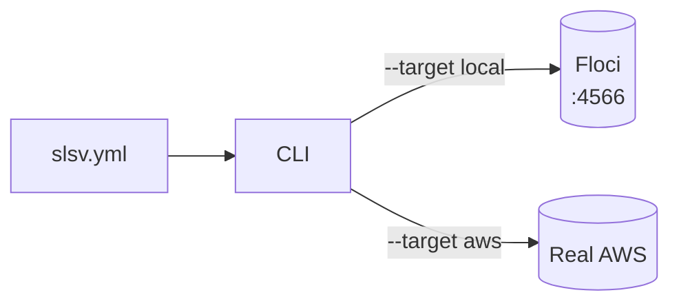

# Architecture overview

## Cloud portability boundary = env vars

slsv injects `DATABASE_<NAME>`, `QUEUE_<NAME>`, `BUCKET_<NAME>`, `REDIS_<NAME>` into every function at deploy time. Handler code resolves resources by logical name — never by ARN or URL.

```ts
// ✅ portable
import { db } from "@slsv/sdk";
const links = await db("links").get({ id });

// ❌ slsv can't migrate this to Floci
import { DynamoDBClient } from "@aws-sdk/client-dynamodb";
const client = new DynamoDBClient({ endpoint: "https://dynamodb.us-east-1.amazonaws.com" });
```

The full SDK surface: [reference/sdk/index.md](../reference/sdk/index.md).

## Provider model



Every resource — Lambda, Dynamo, SQS, S3, EventBridge, Secrets, IAM, Logs — is driven through its native AWS API. No sibling containers, no sidecars, no CloudFormation wrapper. The same code path runs against Floci and real AWS.

## Floci

[Floci](https://github.com/flociorg/floci) is a local AWS emulator on `:4566` (same port as LocalStack). slsv is the orchestration + DX layer; Floci owns the emulation.

- **Health:** `GET /`
- **Global reset:** `POST /_floci/reset`

A Lambda runs **inside** the Floci container, where `localhost` is the container itself. So the `AWS_ENDPOINT_URL` slsv injects for `--target local` is `http://host.docker.internal:4566` (from `LAMBDA_LOCAL_ENDPOINT`), not `localhost:4566`. Same reason, resource URLs (e.g. an SQS `QueueUrl`) that Floci returns with `localhost` are rewritten to `host.docker.internal` before deploy — the SQS SDK dials the URL host directly and ignores `AWS_ENDPOINT_URL`.

For `--target aws`, `AWS_ENDPOINT_URL` is **omitted** so the SDK uses real endpoints.

## What slsv is NOT

- Not a Lambda-only tool — full multi-service.
- Not a CloudFormation/SAM/SST wrapper — direct AWS SDK v3, idempotent get-or-create.
- Not an AWS emulator — Floci owns that. slsv is the orchestration + DX layer.

## Monorepo

```
packages/cli/    # slsv CLI (commander), deployer, bundler, dev loop
packages/sdk/    # @slsv/sdk — handler SDK (db/queue/storage/cache/secret/sql)
```

Only these two packages ship today. The `packages/ui/` React dashboard described in earlier docs is **planned, not in repo** — `slsv ui` does not exist yet.

| | |
|--|--|
| Build all | `pnpm build` |
| Build one | `pnpm --filter slsv build` |
| Lint | `pnpm lint` |
| Test | `pnpm test` |
| Dev CLI | `pnpm --filter slsv dev` |

## Phase 1 services

Lambda · API Gateway · SQS · EventBridge · DynamoDB · S3 · Secrets Manager · IAM exec role · CloudWatch Logs · Valkey (ElastiCache API, `type: redis|valkey`) · Postgres + MySQL (RDS API).